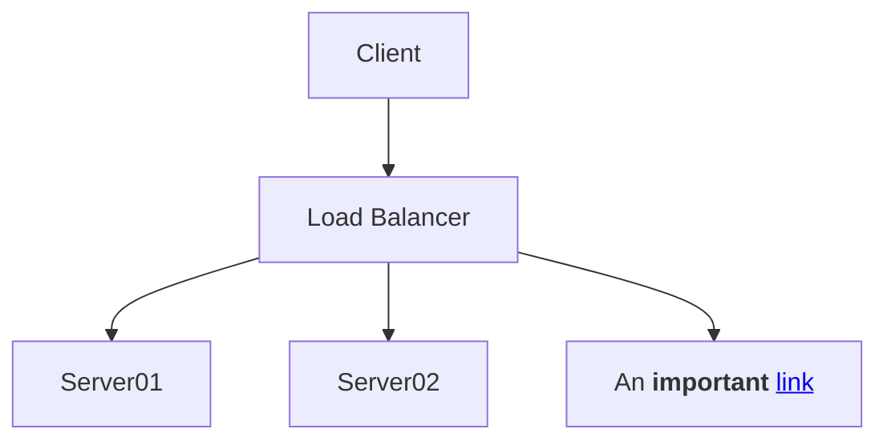

# content.code.annotate glitch with mermaid2

``` yaml
theme:
  features:
    - content.code.annotate # (1)
```

1.  :man_raising_hand: I'm a code annotation! I can contain `code`, __formatted
    text__, images, ... basically anything that can be written in Markdown.


<div class="annotate" markdown>



</div>

(1)

1.  :man_raising_hand: I'm an annotation!
